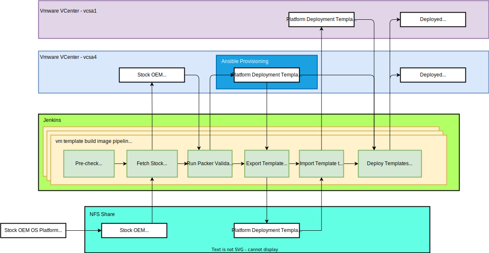
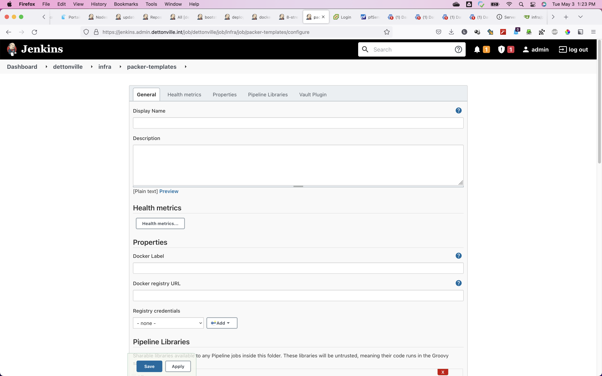
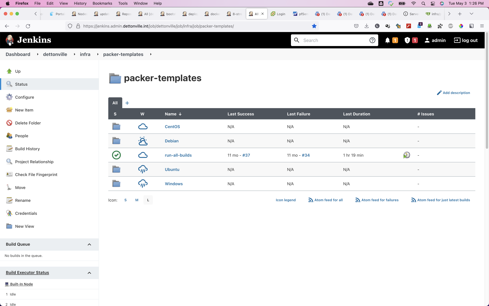
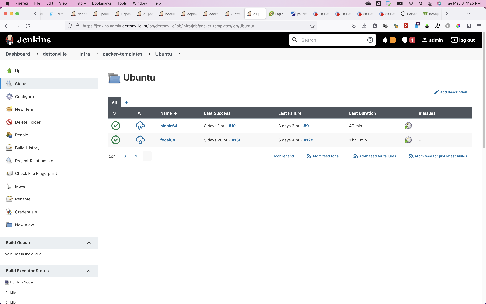
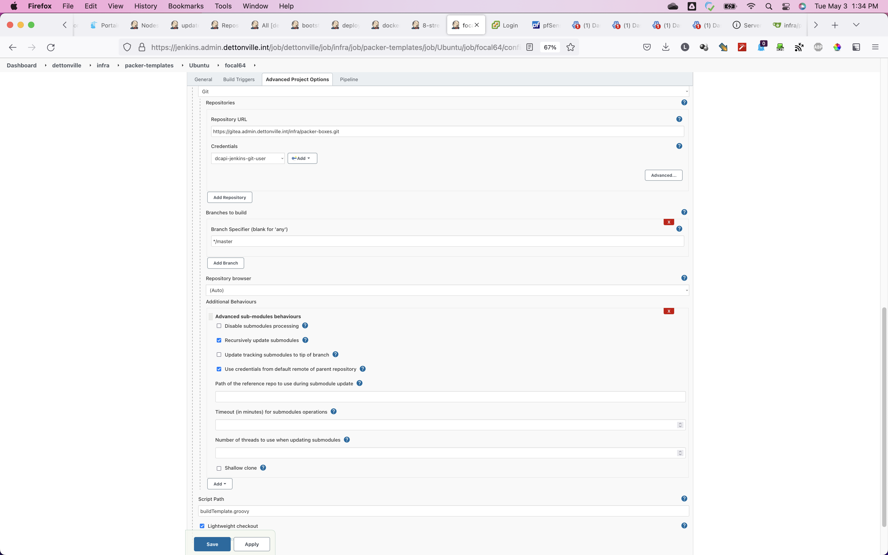

Table of Contents:

* [Information/Notes on VM Template build automation](#informationnotes-on-vm-template-build-automation)
    * [1 - VM Template Build Definition Repository](#1-vm-template-build-definition-repository)
      * [1.1 - VM Template Build Configurations](#1-vm-template-build-configurations)
    * [2 - VM Template Build Automation from Jenkins](#2-vm-template-build-automation-from-jenkins)
        * [Jenkins Project Configurations stored in YAML file format](#jenkins-project-configurations-stored-in-yaml-file-format)
    * [3 - Ansible role to setup docker jenkins control node](#3-ansible-role-to-setup-docker-jenkins-control-node)
        * [Setup pipeline automation library used by all jenkins jobs](#setup-pipeline-automation-library-used-by-all-jenkins-jobs)
        * [The `vars/buildVmTemplate.groovy` functionality](#the-varsbuildvmtemplategroovy-functionality)
    * [Other related/supporting information](#other-relatedsupporting-information)
        * [To refresh template configurations using json sourced files](#to-refresh-template-configurations-using-json-sourced-files)
        * [To Refresh/Update/Repair submodules](#to-refreshupdaterepair-submodules)
        * [Use script to automate / simplify refreshing/repairing submodules](#use-script-to-automate--simplify-refreshingrepairing-submodules)
    * [Reference](#reference)


# Information/Notes on VM Template build automation<a name="informationnotes-on-vm-template-build-automation"></a> 

This project contains the Packer build configurations for vmware templates. 
Each template build configuration includes a minimal template definition for use with Vsphere. 



You can also fork this repository and customize a build configuration with your own Ansible roles and playbooks to build a fully custom template using Packer. 

### GitHub Actions

[](https://github.com/lj020326/vm-templates/actions/workflows/main.yml)
[](LICENSE)

## Requirements

The following software must be installed/present on your local machine before you can use Packer to build any of these Vagrant templatees:

  - [Packer](http://www.packer.io/)
  - [Ansible](https://docs.ansible.com/ansible/latest/installation_guide/intro_installation.html)

I use docker containers for my jenkins build agents which have ansible and packer already installed.
The [specification for the docker agent container image can be found here](https://github.com/lj020326/jenkins-docker-agent/blob/master/image/jenkins-cicd-agent/Dockerfile).
The container leverages the 'jenkins/inbound-agent' image and the [cicd-build-tool image defined here](https://github.com/lj020326/jenkins-docker-agent/blob/master/image/cicd-build-tools/Dockerfile). 

## 1 - VM Template Build Definition Repository<a name="1-vm-template-build-definition-repository"></a> 

The vm template repository can be found at:
    https://github.com/lj020326/vm-templates

## 1.1 - VM Template Build Configurations<a name="1-vm-template-build-configurations"></a> 

Detailed information for the [template build configuration parameters and options can be found here](./docs/configuration.md).

## 2 - VM Template Build Automation from Jenkins<a name="2-vm-template-build-automation-from-jenkins"></a> 

All vm template builds are launched using jenkins pipeline jobs.

The jenkins controller docker instance is setup using the __jenkins config-as-code (jcac) plugin__ to automate the creation of all demo pipelines.

The jenkins pipeline repository can be found at:
    https://github.com/lj020326/pipeline-automation-lib

All the jenkins projects and job pipelines are created from the job dsl script files in the folder at:
    https://github.com/lj020326/pipeline-automation-lib/tree/main/jobs/jobdsl/templates

The job dsl script file used to create all the vm build pipeline jobs is at:
    https://github.com/lj020326/pipeline-automation-lib/blob/main/jobs/jobdsl/templates/01_INFRA/init02_vm_templates.groovy


### Jenkins Project Configurations stored in YAML file format<a name="jenkins-project-configurations-stored-in-yaml-file-format"></a> 

Each jenkins infrastructure project folder has the respective configuration state stored in corresponding YAML files seen in the top level folder:
https://github.com/lj020326/pipeline-automation-lib/tree/main/jobs/jobdsl/templates/01_INFRA

As an example see the configuration for the vm-template pipelines at:
https://github.com/lj020326/pipeline-automation-lib/blob/main/jobs/jobdsl/templates/01_INFRA/config.vm-template-jobs.yml

## 3 - Ansible role to setup docker jenkins control node<a name="3-ansible-role-to-setup-docker-jenkins-control-node"></a> 

An ansible role is used to setup all docker stack instances.

The `bootstrap_docker_stack` ansible role used to stand up the docker stack [can be found here](https://github.com/lj020326/ansible-datacenter/tree/main/roles/bootstrap_docker_stack).

The [`bootstrap_docker_stack` ansible role](https://github.com/lj020326/ansible-datacenter/tree/main/roles/bootstrap_docker_stack) contains the [__jenkins config-as-code (jcac) yaml definition__](https://github.com/lj020326/ansible-datacenter/blob/main/roles/bootstrap_docker_stack/templates/jenkins_jcac/jenkins_casc.yml.j2) in template form used to setup the jenkins jcac instance.

[The jcac definition can be found here](https://github.com/lj020326/ansible-datacenter/blob/main/roles/bootstrap_docker_stack/templates/jenkins_jcac/jenkins_casc.yml.j2).  

### Setup pipeline automation library used by all jenkins jobs<a name="setup-pipeline-automation-library-used-by-all-jenkins-jobs"></a> 

The pipeline automation library used can be found [here](https://github.com/lj020326/pipeline-automation-lib).
[The pipeline automation library](https://github.com/lj020326/pipeline-automation-lib) defines the shared jenkins templates that are used throughout all of the jenkins ansible pipelines.  

Configure the library in jenkins as seen below.


### Site Root folder

A root folder for the packer-templates environment can be setup similar to the following.


### VM Packer Template OS folders

Then setup folders for each VM OS defined as follows.



### VM Packer Template OS Version folders

Then setup folders for each VM OS Version defined as follows.



### VM Packer Template builder pipeline folders

For each template build node at the leaf level, setup a jenkins folder to run the groovy pipeline wrapper used to start the packer VM template builder process.

The folder definition for each VM template build folder should be as follows.


See the job console for the VM packer template build pipeline output.


The detailed [pipeline job console output](./docs/jenkins-consoleText-packer-build-ubuntu-log.md).

### Setup job to run all build template pipelines

Then setup a pipeline job at the top level folder to run the [runAllBuilds.groovy](./runAllBuilds.groovy) as seen below.


This job will launch all of the VM template build jobs defined in [runAllBuilds.groovy](./runAllBuilds.groovy) with output similar to below.


## To repair submodule

### for public/github branch

```shell
$ git switch github
$ git submodule deinit -f .
$ git submodule add --force --name ansible-github https://github.com/lj020326/ansible-datacenter.git ansible/
$ git submodule update --init --recursive --remote
$ git add . && git commit -m 'update submodule' && git push
```

## for master branch
```shell
$ git switch master
$ git submodule deinit -f .
$ git submodule add --force --name ansible git@bitbucket.org:lj020326/ansible-datacenter.git ansible/
$ git submodule update --init --recursive --remote
$ git add . && git commit -m 'update submodule' && git push
```

### To run/debug a script provisioner

```shell
sudo -S -E bash /tmp/script_4278.sh
```

### To run/debug the VM template create playbook on packer created VM

```shell
# find the temp dir used for the ansible-local provisioner from the packer log 
$ cd /tmp/packer-provisioner-ansible-local/63b193ab-d1c4-b355-f4cf-9e9153570896
$ ansible-playbook bootstrap_vm_template.yml --vault-password-file=~/.vault_pass --limit vm_template -e @./vars/vault.yml -c local -i hosts.yml
```

## Other related/supporting information<a name="other-relatedsupporting-information"></a> 

### To refresh template configurations using json sourced files<a name="to-refresh-template-configurations-using-json-sourced-files"></a> 

To refresh template json configuration using the source json files:
```shell
$ alias gitpullsub="git submodule update --recursive --remote"
$ alias gitmergesub="git submodule update --remote --merge && gitaddcommitpush"
$ templates/config.sh 
$ gitaddcommitpush
```

### To Refresh/Update/Repair submodules<a name="to-refreshupdaterepair-submodules"></a> 

```shell
$ alias gitpullsub="git submodule update --recursive --remote"
$ alias gitmergesub="git submodule update --remote --merge && gitaddcommitpush"
$ gitmergesub
$ git status
$ gitaddcommitpush ## git pull origin && git add . && git commit -m get-git-comment && git push origin
```

### Use script to automate / simplify refreshing/repairing submodules<a name="use-script-to-automate-simplify-refreshingrepairing-submodules"></a> 

Run the utility bash script [`refresh-submodules.sh`](refresh-submodules.sh) found in the PROJECT root directory.

```shell
$ ./refresh-submodules.sh 
```

## Notes, Considerations & Final Thoughts...

If defining the ansible playbooks as a submodule the same way done in this repo, make sure that the git repo option to "Recursively update submodules" is set/checked.

## Reference

- https://github.com/vmware-samples
- https://github.com/vmware-samples/packer-examples-for-vsphere
- https://www.hashicorp.com/blog/using-template-files-with-hashicorp-packer
- https://github.com/chef/bento
- https://github.com/burkeazbill/ubuntu-22-04-packer-fusion-workstation/blob/master/http/user-data
- https://github.com/williamsanmartin/packer-template-ubuntu/blob/main/http/user-data
- [vagrant-template-templates](https://github.com/mrlesmithjr/vagrant-template-templates)
- https://github.com/mwrock/packer-templates
- https://github.com/jacqinthetemplate/packer-templates
- https://github.com/geerlingguy/packer-templatees

## Contact

[](https://www.linkedin.com/in/leejjohnson/)

