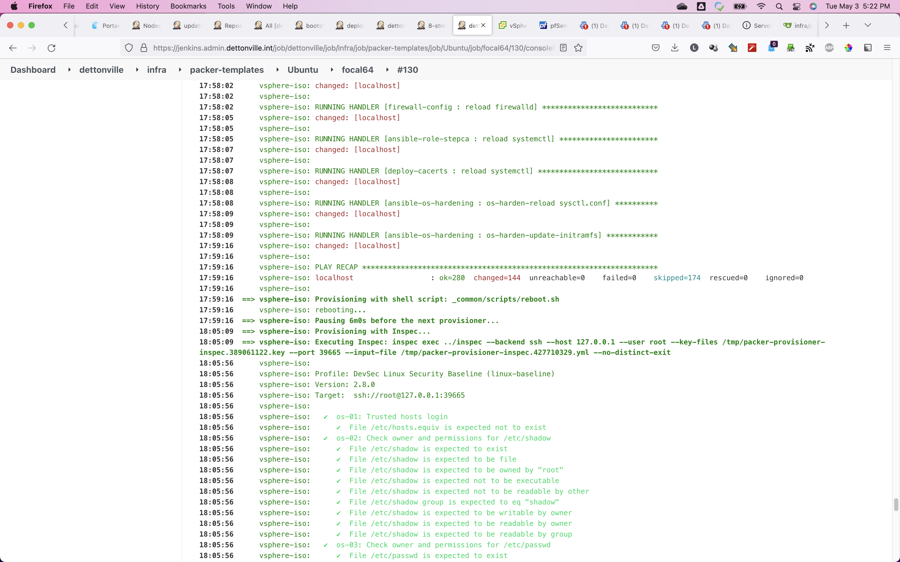

# Dettonville Packer Builds

This project contains the Packer build configurations for all of Dettonville Boxes. Each box builds a minimal base box for use with Vsphere. Available boxes include:

You can also fork this repository and customize a build configuration with your own Ansible roles and playbooks to build a fully custom box using Packer. 

## Requirements

The following software must be installed/present on your local machine before you can use Packer to build any of these Vagrant boxes:

  - [Packer](http://www.packer.io/)
  - [Ansible](https://docs.ansible.com/ansible/latest/installation_guide/intro_installation.html)

I use docker containers for my jenkins build agents which have ansible and packer already installed.
The [specification for the docker agent container image can be found here](https://github.com/lj020326/jenkins-docker-agent/blob/master/image/jenkins-cicd-agent/Dockerfile).
The container leverages the 'jenkins/inbound-agent' image and the [cicd-build-tool image defined here](https://github.com/lj020326/jenkins-docker-agent/blob/master/image/cicd-build-tools/Dockerfile). 

## Jenkins Pipeline Usage

### Setup pipeline automation library used by all jenkins jobs
The pipeline automation library used can be found [here](https://github.com/lj020326/pipeline-automation-lib).
[The pipeline automation library](https://github.com/lj020326/pipeline-automation-lib) defines the shared jenkins templates that are used throughout all of the jenkins ansible pipelines.  

Configure the library in jenkins as seen below.

### Site Root folder

A root folder for the packer-templates environment can be setup similar to the following.

### VM Packer Template OS folders

Then setup folders for each VM OS defined as follows.

### VM Packer Template OS Version folders

Then setup folders for each VM OS Version defined as follows.

### VM Packer Template builder pipeline folders

For each template build node at the leaf level, setup a jenkins folder to run the groovy pipeline wrapper used to start the packer VM template builder process.

The folder definition for each VM template build folder should be as follows.

See the job console for the VM packer template build pipeline output.

The detailed [pipeline job console output](./docs/jenkins-consoleText-packer-build-ubuntu-log.md).

### Setup job to run all build template pipelines

Then setup a pipeline job at the top level folder to run the [runAllBuilds.groovy](./runAllBuilds.groovy) as seen below.

This job will launch all of the VM template build jobs defined in [runAllBuilds.groovy](./runAllBuilds.groovy) with output similar to below.

## Notes, Considerations & Final Thoughts...

If defining the ansible playbooks as a submodule the same way done in this repo, make sure that the git repo option to "Recursively update submodules" is set/checked.
