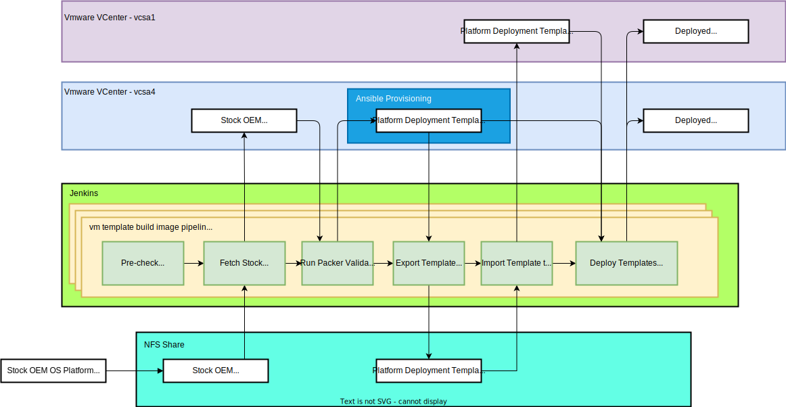

# VM Templates - Packer + Ansible Build Repository

## Summary

* **Automated, reproducible VM template builds for vSphere using Packer and Ansible.**


This repository contains the complete Packer build definitions and supporting automation for creating **standardized, hardened, and reproducible VM templates** across multiple operating systems (Ubuntu, RHEL, CentOS, Debian, and Windows) for VMware vSphere.

**Ansible** is heavily used post-provisioning to apply consistent configuration, security hardening, baseline compliance, and tooling across all templates.



---

## Audience

Designed for **Platform Automation Engineers**, **SREs**, and **Infrastructure Architects** who require reliable, version-controlled, and auditable VM templates as the foundation for their workloads.

---

## CI Status

[](https://github.com/lj020326/vm-templates/actions/workflows/main.yml)

---

## Key Features

- **Hybrid Configuration**: Source of truth in clean JSON + rendered HCL2 via `ensure-template-configs.py`
- **Multi-OS Support**: Ubuntu, CentOS/RHEL, Debian, and Windows Server/Desktop
- **Flexible Sizing**: small / medium / large LVM layouts with BIOS + EFI support
- **Ansible Post-Provisioning**: Consistent hardening, security baselines, and tooling
- **Full Jenkins Pipeline Integration** with shared Groovy library
- **Incremental config conversion** with caching for fast feedback loops
- **GitHub Actions validation** on every commit

---

## Repository Structure

```bash
templates/
├── common-vars.json                  # Shared variables
├── ensure-template-configs.py        # JSON → HCL2 converter (recommended)
├── Ubuntu/
│   ├── distribution-vars.json.pkrvars.hcl
│   └── 26.04/server/
│       ├── box_info.medium.json.pkrvars.hcl
│       └── template.json.pkrvars.hcl
├── Windows/
│   └── server/
├── env-vars.PROD.json.pkrvars.hcl
└── ...
```

---

## Quick Start

1. Refresh Configurations
```bash
python3 ensure-template-configs.py --force
```
2. Validate a Template

```bash
cd templates

# Ubuntu example
packer validate -only vsphere-iso.Ubuntu \
  -var-file=env-vars.PROD.json.pkrvars.hcl \
  -var-file=Ubuntu/distribution-vars.json.pkrvars.hcl \
  -var-file=Ubuntu/26.04/server/template.json.pkrvars.hcl \
  -var-file=Ubuntu/26.04/server/box_info.small.json.pkrvars.hcl \
  -var vm_template_build_type=small \
  -var vm_template_name=vm-template-ubuntu26.04-small-prod \
  -var vm_build_env=PROD \
  -var iso_dir=Ubuntu/26.04 \
  -var iso_file=ubuntu-26.04-live-server-amd64.iso \
  Ubuntu/

## Debian
packer validate \
  -only vsphere-iso.Debian \
  -var-file=env-vars.PROD.json.pkrvars.hcl \
  -var-file=Debian/distribution-vars.json.pkrvars.hcl \
  -var-file=Debian/12/server/template.json.pkrvars.hcl \
  -var-file=Debian/12/server/box_info.small.json.pkrvars.hcl \
  -var vm_template_build_type=small \
  -var vm_template_name=vm-template-debian12-small-prod \
  -var vm_build_env=PROD \
  Debian/
```

3. Build (via Jenkins or locally)
```bash
cd templates

# Ubuntu example
packer build -only vsphere-iso.Ubuntu \
  -on-error=abort \
  -var-file=env-vars.PROD.json.pkrvars.hcl \
  -var-file=Ubuntu/distribution-vars.json.pkrvars.hcl \
  -var-file=Ubuntu/26.04/server/template.json.pkrvars.hcl \
  -var-file=Ubuntu/26.04/server/box_info.small.json.pkrvars.hcl \
  -var vm_template_build_name=vm-template-ubuntu26.04-small-prod-00006 \
  -var vm_template_build_type=small \
  -var vm_template_name=vm-template-ubuntu26.04-small-prod \
  -var vm_build_env=PROD \
  -var iso_dir=Ubuntu/26.04 \
  -var iso_file=ubuntu-26.04-live-server-amd64.iso \
  Ubuntu/
```

## Automation Architecture

### Jenkins Pipeline Structure

* Top Level: packer-templates folder
* OS Level: Ubuntu, Windows, CentOS, etc.
* Version Level: 26.04, 24.04, 2022, etc.
* Build Level: Individual template jobs (e.g., focal64, bionic64)

Shared pipeline logic is provided by the [`pipeline-automation-lib`](https://github.com/lj020326/pipeline-automation-lib) library.

### Tooling Stack

* Packer (vsphere-iso builder)
* Ansible (post-provisioning + hardening)
* Jenkins with JCasC and Shared Libraries
* Python (`ensure-template-configs.py`) for config management

### Jenkins Job Configuration

Detailed instructions on jenkins job configuration, parameter initialization, and Jenkins-led execution can be found in the documentation link below:

* **[Jenkins VM Template build automation](./docs/jenkins-pipelines-for-vm-template-builds.md)**

## Maintenance

### Refresh Template Configurations
```bash
python3 ensure-template-configs.py -L INFO
git add templates/ && git commit -m "chore: refresh packer hcl configs"
```

### Update Submodules
```bash
./refresh-submodules.sh
```

## Related Repositories

| Repository                                                                       | Purpose                                      |
|----------------------------------------------------------------------------------|----------------------------------------------|
| [`pipeline-automation-lib`](https://github.com/lj020326/pipeline-automation-lib) | Shared Jenkins Groovy pipelines              |
| [`ansible-datacenter`](https://github.com/lj020326/ansible-datacenter)           | "Ansible roles (hardening, bootstrap, etc.)" |
| [`jenkins-docker-agent`](https://github.com/lj020326/jenkins-docker-agent)       | Build agent Docker images                    |

---

## License

[](LICENSE)

---

## Contributing & Support

* **Reporting Issues:** Please use the GitHub Issues tab to report bugs or request features.
* **Pull Requests:** Contributions are welcome. Please ensure all Molecule tests pass before submitting.
* **Contact:** Connect with [Lee James Johnson on LinkedIn](https://www.linkedin.com/in/leejjohnson/).

---

## Documentation Links

* [`HashiCorp Packer Documentation`](https://www.packer.io/docs)
* [`Packer Examples for vSphere`](https://github.com/vmware-samples/packer-examples-for-vsphere)
* [`Bento Project`](https://github.com/chef/bento)
