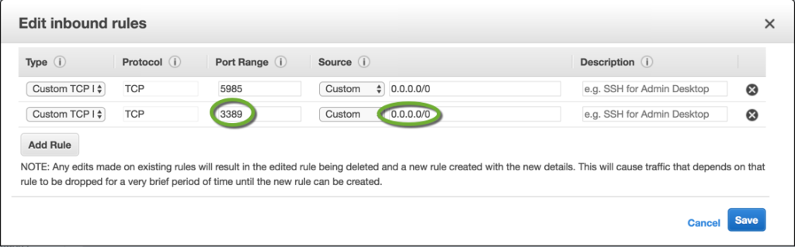

# How to debug a windows build

Packer can configure a server instance and create an image of it.

If you need to examine what Packer is doing, you can run Packer in debug mode and RDP into the instance to view files and other settings.

### Open the firewall

1.  In the “**builders**” element add a line to the Packer template to execute a configuration file:
    
    ```json
    "user_data_file": "bootstrap-aws.txt",
    ```
    
2.  Create the **bootstrap-aws.txt** file in the same directory where your Packer template is located,
3.  Add lines to the **bootstrap-aws.txt** file to create an administrator user, enable the Remote Desktop connection, and open the firewall for the RDP port:
    
    ```shell
    # Administrator user
    cmd.exe /c net user /add MY_USERNAME MY_PASSWORD
    cmd.exe /c net localgroup administrators MY_USERNAME /add
    
    # RDP
    cmd.exe /c netsh advfirewall firewall add rule name="Open Port 3389" dir=in action=allow protocol=TCP localport=3389
    cmd.exe /c reg add "HKEY_LOCAL_MACHINE\SYSTEM\CurrentControlSet\Control\Terminal Server" /v fDenyTSConnections /t REG_DWORD /d 0 /f
    ```
    

### Build in debug mode

1.  Execute the build with the -debug option:
    
    ```shell
    packer build -debug win2012.json
    ```
    

### Open the RDP port in the temporary security group

During the build, Packer will prompt you to press enter before major steps.

1.  When the IP address of the instance is displayed on the screen, search for the temporary security group’s name by
    
    ```
    Creating temporary security group for this instance
    ```
    
2.  In the AWS console search for the security group and add a new inbound rule to open port: 3389 for the Remote Desktop Connection:  
    

### Connect to the instance

1.  Find the IP address of the instance on the screen,
2.  Start a Remote Desktop connection to the instance,
3.  Use the administrator username and password specified in the **bootstrap-aws.txt file.**

### Log locations

1.  The EC2 log file on the instance is at  
    **C:\\Program Files\\Amazon\\Ec2ConfigService\\Logs\\Ec2ConfigLog.txt**

## Reference

- https://pinter.org/archives/6871
- 

