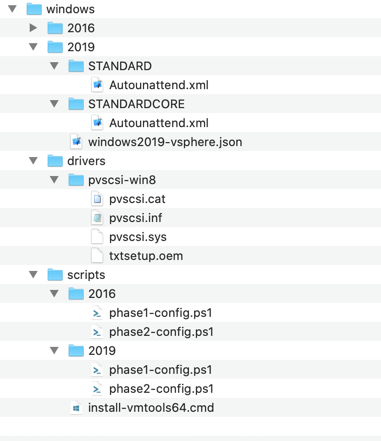
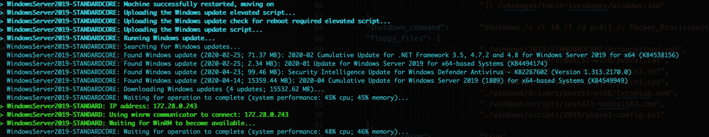
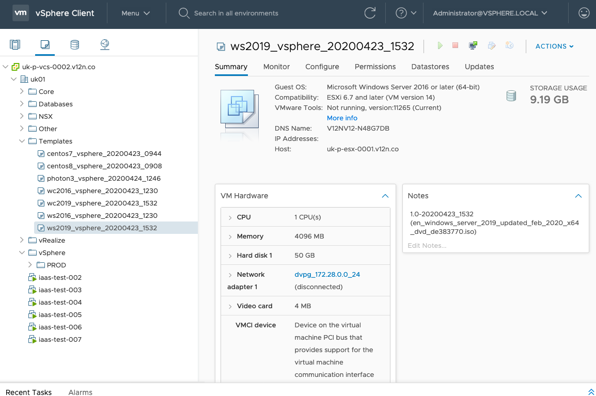

# Configuring The VMware PVSCSI Adapter for a New Windows Installation

It feels like it took a while to get here. In this post though, it's time for the juice! Previous posts have covered the background, terminology and components of Packer. Now it's time to create a template file and get Packer to build.

Template files, as I have mentioned previously, are JSON formatted and define what it is to Packer that you want it to do. These templates can contain a number of elements:

1.  Variables
2.  Builders
3.  Provisioners
4.  Post-Processors (I haven't used any)

**Variables**

I covered variables in the previous two posts. But, you can add variables in to the template files too. You don't have to, they're optional. But putting any template-specific variables at the top of your template file helps others to find the bits that need changing, if they ever do. Let's look at the top of my Windows template file (I'll use Windows 2019 but 2016 is very similar):

```
{
  "variables": {
    "var_vm_name_ext":          "2019_vsphere_{{isotime \"20060102_1504\"}}",
    "var_vm_guestos":           "windows9Server64Guest",
    "var_vm_cpu_count":         "1",
    "var_vm_disk_controller":   "pvscsi",
    "var_vm_disk_size":         "51200",
    "var_vm_notes":             "1.0-{{isotime \"20060102_1504\"}} (en_windows_server_2019_updated_feb_2020_x64_dvd_de383770.iso)",
    "var_iso_path":             "os/microsoft/server/2019/en_windows_server_2019_updated_feb_2020_x64_dvd_de383770.iso",
    "var_guest_username":       "administrator",
    "var_guest_password":       "yourpassword"
  },
```

Variables section of Windows 2019 template JSON

Let me explain these:

-   var\_vm\_name\_ext - The VM needs a name in vCenter. I wanted the build date added in to the name of the VM. The "isotime" function evaluates the current date / time based on [golang formatting](https://www.packer.io/guides/workflow-tips-and-tricks/isotime-template-function.html). This name "extension" variable value is added to the VM name in the Builders section of the template.
-   var\_vm\_guestos - This is the guest OS identifier in vSphere. When you select your OS type and version in vCenter, this is the value that gets set on the VM. The list of possible values is [documented here](https://vdc-download.vmware.com/vmwb-repository/dcr-public/da47f910-60ac-438b-8b9b-6122f4d14524/16b7274a-bf8b-4b4c-a05e-746f2aa93c8c/doc/vim.vm.GuestOsDescriptor.GuestOsIdentifier.html).
-   var\_vm\_cpu\_count - This is the number of vCPUs the VM should be configured with. I configured my VMs small so that they can be scaled up if required.
-   var\_vm\_disk\_controller - This is the type of disk controller that should be configured. It's not the standard for Windows VMs in vSphere but I prefer it. However, it does mean that a driver is needed to install Windows. More on that later.
-   var\_vm\_disk\_size - This is the size of the system disk (in MB) that I want my VMs to be created with.
-   var\_vm\_notes - This is the value that I want written in to the VM's annotations field. Again it includes the date / time. This will show up when the template is viewed in vCenter.
-   var\_iso\_path - The relative path to the ISO file from which I want to install. This will be appended later to the ISO datastore that I defined in my vSphere variables in the previous post.
-   var\_guest\_username - The user name of the user that Packer will use to connect to the VM after the OS is installed and it first boots.
-   var\_guest\_password - The password for the user above. These credentials must match what is configured in the unattended answer file for Windows.

**Builders**

Next in the template file is the builders definition. Multiple builders can be included in a single template file. Each builder maps exactly to one VM. In my Windows 2019 template I have two builders, one for Windows 2019 Standard and one for Windows 2019 Standard Core. The two are virtually identical so let's just look at one of them.

```
"builders": [
    {
      "type":                   "vsphere-iso",
      "name":                   "WindowsServer2019-STANDARD",
    
      "vcenter_server":         "{{user `var_vsphere_vcenter`}}",
      "username":               "{{user `var_vsphere_username`}}",
      "password":               "{{user `var_vsphere_password`}}",
      "insecure_connection":    "true",
    
      "datacenter":             "{{user `var_vsphere_datacenter`}}",
      "cluster":                "{{user `var_vsphere_cluster`}}",
      "folder":                 "{{user `var_vsphere_folder`}}",
      "datastore":              "{{user `var_vsphere_datastore`}}",
      "network":                "{{user `var_vsphere_network`}}",
      "convert_to_template":    "true",
    
      "vm_name":                "ws{{user `var_vm_name_ext`}}",
      "guest_os_type":          "{{user `var_vm_guestos`}}",
      "CPUs":                   "{{user `var_vm_cpu_count`}}",
      "RAM":                    "4096",
      "disk_controller_type":   "{{user `var_vm_disk_controller`}}",
      "disk_size":              "{{user `var_vm_disk_size`}}",
      "disk_thin_provisioned":  true,
      "network_card":           "vmxnet3",
      "notes":                  "{{user `var_vm_notes`}}",
    
      "communicator":           "winrm",
      "winrm_username":         "{{user `var_guest_username`}}",
      "winrm_password":         "{{user `var_guest_password`}}",
    
      "iso_paths": [
                                "{{user `var_vsphere_iso_datastore`}} {{user `var_iso_path`}}",
                                "[] /vmimages/tools-isoimages/windows.iso"
      ],
      "shutdown_command": "shutdown /s /t 10 /f /d p:4:1 /c Packer_Provisioning_Shutdown",
      "floppy_files": [
                                "./windows/2019/STANDARD/Autounattend.xml",
                                "./windows/drivers/pvscsi-win8/pvscsi.cat",
                                "./windows/drivers/pvscsi-win8/pvscsi.inf",
                                "./windows/drivers/pvscsi-win8/pvscsi.sys",
                                "./windows/drivers/pvscsi-win8/txtsetup.oem",
                                "./windows/scripts/install-vmtools64.cmd",
                                "./windows/scripts/2019/phase1-config.ps1"
        ],
      "remove_cdrom":           "true"
    },
```

Ready for this? Let me explain what these settings all do... (Note that most of the entries pull in values from the various vSphere and template-specific variables that I created. Given that there's two of these builder definitions in my Windows template, you can see why it made sense to use variables I hope!)

-   type - Remember that I said builders were like plugins? The type tells Packer what builder to use. In this case it's the vSphere ISO builder. There are many others available.
-   name - Because I have two builders in this template that are both of type "vsphere-iso" I have to differentiate them. Each one has a unique name, in this case it's "WindowsServer2019-STANDARD".
-   vcenter\_server to convert\_to\_template - These the settings that tell the builder how to connect to vCenter and where to provision the VM.
-   vm\_name - This is how the VM object gets named in vCenter. The "extension" I defined above is added to "ws" to produce the name.
-   guest\_os\_type to notes - These are VM-specific hardware settings, hopefully all self-explanatory. The network card type I could probably put in a variable too I guess. The RAM I didn't put in a variable because it's different for Windows 2019 Standard Core. There it's 2GB instead of 4GB.
-   communicator - This is the mechanism by which Packer will connect to the VM when I define my provisioners. The username and password below are the credentials it will use.
-   iso\_paths - There are two entries. The first is the OS installation ISO. The second is to the VMtools ISO on the ESXi host. That is used later to install VMtools. It means that the Windows ISO will be mounted on the VM's D:\\ drive and VMtools will be mounted on the VM's E:\\ drive.
-   shutdown\_command - This is the command that Packer issues to the OS in the VM when the build is complete and all Provisioners have successfully executed. It shuts down Windows.
-   floppy\_files - I'll explain that below.
-   remove\_cdrom - This seemingly undocumented option removes the CD drives from the VM after it has shutdown. For the most part I doubt that my Windows VMs will need CD drives.

All of that is repeated again for Windows 2019 Standard Core build with the only differences being the VM's name, the amount of RAM allocated and the Autounattend.xml file used on the floppy disk.

On that topic, let me explain the floppy files. To perform an unattended / scripted installation of a Windows OS, you need to give it a configuration file that replaces all of the mouse clicks and key presses that you'd otherwise have to make. You could bake such a file in to your own update version of the ISO file (I think it's possible) but you'd have to do that everytime a new ISO came out and making changes would be time-consuming. For the duration of the install however, having a floppy disk image mounted containing that XML file is something that Packer can automate very easily. The floppy\_files option tells Packer which files you want it to combine in to a floppy disk image and present to the VM.



The folder structure where files are taken from to form a floppy disk image

Aside from the Autounattend.xml file I've also included the four files from the _pvscsi-win8_ folder. These are the driver files for the ParaVirtual Disk Controller. Without these Windows would not find a disk to install on! Also present is a small script to trigger a silent installation of VMtools. Until that's done Windows won't pick up the vmxnet3 network card and the VM won't be able to connect to anything. Finally, phase1-config.ps1. This is a script that I've put there that performs some initial configuration of the VM's OS (kudos to [Mark Brookfield](https://twitter.com/virtualhobbit) for the source). Both this and the VMtools command are triggered as part of the Windows deployment. This is the content for the PS script:

<table data-tab-size="8" data-paste-markdown-skip="" data-tagsearch-lang="PowerShell" data-tagsearch-path="phase1-config.ps1"><tbody><tr><td id="file-phase1-config-ps1-L1" data-line-number="1"></td><td id="file-phase1-config-ps1-LC1"><span><span>#</span> Basic configuration of vanilla Windows Server installation to progress Packer.io builds</span></td></tr><tr><td id="file-phase1-config-ps1-L2" data-line-number="2"></td><td id="file-phase1-config-ps1-LC2"><span><span>#</span> @author Michael Poore</span></td></tr><tr><td id="file-phase1-config-ps1-L3" data-line-number="3"></td><td id="file-phase1-config-ps1-LC3"><span><span>#</span> @website https://blog.v12n.io</span></td></tr><tr><td id="file-phase1-config-ps1-L4" data-line-number="4"></td><td id="file-phase1-config-ps1-LC4"><span><span>#</span> @source https://github.com/virtualhobbit</span></td></tr><tr><td id="file-phase1-config-ps1-L5" data-line-number="5"></td><td id="file-phase1-config-ps1-LC5"><span>$ErrorActionPreference</span> <span>=</span> <span><span>"</span>Stop<span>"</span></span></td></tr><tr><td id="file-phase1-config-ps1-L6" data-line-number="6"></td><td id="file-phase1-config-ps1-LC6"></td></tr><tr><td id="file-phase1-config-ps1-L7" data-line-number="7"></td><td id="file-phase1-config-ps1-LC7"><span><span>#</span> Switch network connection to private mode</span></td></tr><tr><td id="file-phase1-config-ps1-L8" data-line-number="8"></td><td id="file-phase1-config-ps1-LC8"><span><span>#</span> Required for WinRM firewall rules</span></td></tr><tr><td id="file-phase1-config-ps1-L9" data-line-number="9"></td><td id="file-phase1-config-ps1-LC9"><span>$profile</span> <span>=</span> <span>Get-NetConnectionProfile</span></td></tr><tr><td id="file-phase1-config-ps1-L10" data-line-number="10"></td><td id="file-phase1-config-ps1-LC10"><span>Set-NetConnectionProfile</span> <span>-</span>Name <span>$profile<span>.Name</span></span> <span>-</span>NetworkCategory Private</td></tr><tr><td id="file-phase1-config-ps1-L11" data-line-number="11"></td><td id="file-phase1-config-ps1-LC11"></td></tr><tr><td id="file-phase1-config-ps1-L12" data-line-number="12"></td><td id="file-phase1-config-ps1-LC12"><span><span>#</span> Enable WinRM service</span></td></tr><tr><td id="file-phase1-config-ps1-L13" data-line-number="13"></td><td id="file-phase1-config-ps1-LC13">winrm quickconfig <span>-</span>quiet</td></tr><tr><td id="file-phase1-config-ps1-L14" data-line-number="14"></td><td id="file-phase1-config-ps1-LC14">winrm set winrm<span>/</span>config<span>/</span>service <span><span>'</span>@{AllowUnencrypted="true"}<span>'</span></span></td></tr><tr><td id="file-phase1-config-ps1-L15" data-line-number="15"></td><td id="file-phase1-config-ps1-LC15">winrm set winrm<span>/</span>config<span>/</span>service<span>/</span>auth <span><span>'</span>@{Basic="true"}<span>'</span></span></td></tr><tr><td id="file-phase1-config-ps1-L16" data-line-number="16"></td><td id="file-phase1-config-ps1-LC16"></td></tr><tr><td id="file-phase1-config-ps1-L17" data-line-number="17"></td><td id="file-phase1-config-ps1-LC17"><span><span>#</span> Reset auto logon count</span></td></tr><tr><td id="file-phase1-config-ps1-L18" data-line-number="18"></td><td id="file-phase1-config-ps1-LC18"><span><span>#</span> https://docs.microsoft.com/en-us/windows-hardware/customize/desktop/unattend/microsoft-windows-shell-setup-autologon-logoncount#logoncount-known-issue</span></td></tr><tr><td id="file-phase1-config-ps1-L19" data-line-number="19"></td><td id="file-phase1-config-ps1-LC19"><span>Set-ItemProperty</span> <span>-</span>Path <span><span>'</span>HKLM:\SOFTWARE\Microsoft\Windows NT\CurrentVersion\Winlogon<span>'</span></span> <span>-</span>Name AutoLogonCount <span>-</span>Value <span>0</span></td></tr></tbody></table>

All it does is enable WinRM (Windows Remote Management) so that Packer can connect to execute the Provisioners. Speaking of which...

**Provisioners**

This is the last section of my Windows template for Packer. I have defined three provisioners. Each type has different options:

```
"provisioners": [
    {
      "type":                   "powershell",
      "scripts":                ["./windows/scripts/2019/phase2-config.ps1"]
    },
    {
      "type":                   "windows-restart",
      "restart_timeout":        "30m"
    },
    {
      "type":                   "windows-update",
      "search_criteria":        "IsInstalled=0",
      "filters": [
                                "exclude:$_.Title -like '*Preview*'",
                                "include:$true"
      ]
    }
  ]
```

Provisioner definition for Windows 2019

1.  This executes my phase 2 configuration script. I'll pop that in below.
2.  Restarts Windows just to make sure that there aren't any pending operations before the next provisioner kicks in.
3.  I mentioned this one in my second post. It's a third-party provisioner that manages the installation of Windows Updates. It's absolutely genius! When executing the output is echoed back to Packer so you can follow along with what it's doing. Below is a quick snippet of Packr running my Windows 2019 template and the Standard Core build hitting the patching provisioner:



The Windows Update provisioner in action

As promised, this is the content of my phase 2 powershell script:

<table data-tab-size="8" data-paste-markdown-skip="" data-tagsearch-lang="PowerShell" data-tagsearch-path="phase2-config.ps1"><tbody><tr><td id="file-phase2-config-ps1-L1" data-line-number="1"></td><td id="file-phase2-config-ps1-LC1"><span><span>#</span> Second-phase configuration of vanilla Windows Server installation to progress Packer.io builds</span></td></tr><tr><td id="file-phase2-config-ps1-L2" data-line-number="2"></td><td id="file-phase2-config-ps1-LC2"><span><span>#</span> @author Michael Poore</span></td></tr><tr><td id="file-phase2-config-ps1-L3" data-line-number="3"></td><td id="file-phase2-config-ps1-LC3"><span><span>#</span> @website https://blog.v12n.io</span></td></tr><tr><td id="file-phase2-config-ps1-L4" data-line-number="4"></td><td id="file-phase2-config-ps1-LC4"><span>$ErrorActionPreference</span> <span>=</span> <span><span>"</span>Stop<span>"</span></span></td></tr><tr><td id="file-phase2-config-ps1-L5" data-line-number="5"></td><td id="file-phase2-config-ps1-LC5"></td></tr><tr><td id="file-phase2-config-ps1-L6" data-line-number="6"></td><td id="file-phase2-config-ps1-LC6"><span><span>#</span> Variables</span></td></tr><tr><td id="file-phase2-config-ps1-L7" data-line-number="7"></td><td id="file-phase2-config-ps1-LC7"><span>$certUrl</span> <span>=</span> <span><span>"</span>http://&lt;&lt;PKI server&gt;&gt;/CertEnroll<span>"</span></span></td></tr><tr><td id="file-phase2-config-ps1-L8" data-line-number="8"></td><td id="file-phase2-config-ps1-LC8"><span>$certRoot</span> <span>=</span> <span><span>"</span>Root-CA.crt<span>"</span></span></td></tr><tr><td id="file-phase2-config-ps1-L9" data-line-number="9"></td><td id="file-phase2-config-ps1-LC9"><span>$certIssuing</span> <span>=</span> <span><span>"</span>uIssuing-CA.crt<span>"</span></span></td></tr><tr><td id="file-phase2-config-ps1-L10" data-line-number="10"></td><td id="file-phase2-config-ps1-LC10"><span>$repository</span> <span>=</span> <span><span>"</span>http://&lt;&lt;artifactory&gt;&gt;:8082/artifactory/packer-local/windows/common/utils/BGinfo<span>"</span></span></td></tr><tr><td id="file-phase2-config-ps1-L11" data-line-number="11"></td><td id="file-phase2-config-ps1-LC11"><span>$bgiBinary</span> <span>=</span> <span><span>"</span>Bginfo64.exe<span>"</span></span></td></tr><tr><td id="file-phase2-config-ps1-L12" data-line-number="12"></td><td id="file-phase2-config-ps1-LC12"><span>$bgiConfig</span> <span>=</span> <span><span>"</span>v12n.bgi<span>"</span></span></td></tr><tr><td id="file-phase2-config-ps1-L13" data-line-number="13"></td><td id="file-phase2-config-ps1-LC13"></td></tr><tr><td id="file-phase2-config-ps1-L14" data-line-number="14"></td><td id="file-phase2-config-ps1-LC14"><span><span>#</span> SettingSet Explorer view options</span></td></tr><tr><td id="file-phase2-config-ps1-L15" data-line-number="15"></td><td id="file-phase2-config-ps1-LC15"><span>Write-Host</span> <span><span>"</span>Setting default Explorer view options<span>"</span></span></td></tr><tr><td id="file-phase2-config-ps1-L16" data-line-number="16"></td><td id="file-phase2-config-ps1-LC16"><span>Set-ItemProperty</span> <span><span>"</span>HKCU:\SOFTWARE\Microsoft\Windows\CurrentVersion\Explorer\Advanced<span>"</span></span> <span><span>"</span>Hidden<span>"</span></span> <span>1</span> <span>|</span> <span>Out-Null</span></td></tr><tr><td id="file-phase2-config-ps1-L17" data-line-number="17"></td><td id="file-phase2-config-ps1-LC17"><span>Set-ItemProperty</span> <span><span>"</span>HKCU:\SOFTWARE\Microsoft\Windows\CurrentVersion\Explorer\Advanced<span>"</span></span> <span><span>"</span>HideFileExt<span>"</span></span> <span>0</span> <span>|</span> <span>Out-Null</span></td></tr><tr><td id="file-phase2-config-ps1-L18" data-line-number="18"></td><td id="file-phase2-config-ps1-LC18"><span>Set-ItemProperty</span> <span><span>"</span>HKCU:\SOFTWARE\Microsoft\Windows\CurrentVersion\Explorer\Advanced<span>"</span></span> <span><span>"</span>HideDrivesWithNoMedia<span>"</span></span> <span>0</span> <span>|</span> <span>Out-Null</span></td></tr><tr><td id="file-phase2-config-ps1-L19" data-line-number="19"></td><td id="file-phase2-config-ps1-LC19"><span>Set-ItemProperty</span> <span><span>"</span>HKCU:\SOFTWARE\Microsoft\Windows\CurrentVersion\Explorer\Advanced<span>"</span></span> <span><span>"</span>ShowSyncProviderNotifications<span>"</span></span> <span>0</span> <span>|</span> <span>Out-Null</span></td></tr><tr><td id="file-phase2-config-ps1-L20" data-line-number="20"></td><td id="file-phase2-config-ps1-LC20"></td></tr><tr><td id="file-phase2-config-ps1-L21" data-line-number="21"></td><td id="file-phase2-config-ps1-LC21"><span><span>#</span> Disable system hibernation</span></td></tr><tr><td id="file-phase2-config-ps1-L22" data-line-number="22"></td><td id="file-phase2-config-ps1-LC22"><span>Write-Host</span> <span><span>"</span>Disabling system hibernation<span>"</span></span></td></tr><tr><td id="file-phase2-config-ps1-L23" data-line-number="23"></td><td id="file-phase2-config-ps1-LC23"><span>Set-ItemProperty</span> <span><span>"</span>HKLM:\SYSTEM\CurrentControlSet\Control\Power\<span>"</span></span> <span>-</span>Name <span><span>"</span>HiberFileSizePercent<span>"</span></span> <span>-</span>Value <span>0</span> <span>|</span> <span>Out-Null</span></td></tr><tr><td id="file-phase2-config-ps1-L24" data-line-number="24"></td><td id="file-phase2-config-ps1-LC24"><span>Set-ItemProperty</span> <span><span>"</span>HKLM:\SYSTEM\CurrentControlSet\Control\Power\<span>"</span></span> <span>-</span>Name <span><span>"</span>HibernateEnabled<span>"</span></span> <span>-</span>Value <span>0</span> <span>|</span> <span>Out-Null</span></td></tr><tr><td id="file-phase2-config-ps1-L25" data-line-number="25"></td><td id="file-phase2-config-ps1-LC25"></td></tr><tr><td id="file-phase2-config-ps1-L26" data-line-number="26"></td><td id="file-phase2-config-ps1-LC26"><span><span>#</span> Disable TLS 1.0</span></td></tr><tr><td id="file-phase2-config-ps1-L27" data-line-number="27"></td><td id="file-phase2-config-ps1-LC27"><span>Write-Host</span> <span><span>"</span>Disabling TLS 1.0<span>"</span></span></td></tr><tr><td id="file-phase2-config-ps1-L28" data-line-number="28"></td><td id="file-phase2-config-ps1-LC28"><span>New-Item</span> <span>-</span>Path <span><span>"</span>HKLM:\SYSTEM\CurrentControlSet\Control\SecurityProviders\SCHANNEL\Protocols<span>"</span></span> <span>-</span>Name <span><span>"</span>TLS 1.0<span>"</span></span> <span>|</span> <span>Out-Null</span></td></tr><tr><td id="file-phase2-config-ps1-L29" data-line-number="29"></td><td id="file-phase2-config-ps1-LC29"><span>New-Item</span> <span>-</span>Path <span><span>"</span>HKLM:\SYSTEM\CurrentControlSet\Control\SecurityProviders\SCHANNEL\Protocols\TLS 1.0<span>"</span></span> <span>-</span>Name <span><span>"</span>Server<span>"</span></span> <span>|</span> <span>Out-Null</span></td></tr><tr><td id="file-phase2-config-ps1-L30" data-line-number="30"></td><td id="file-phase2-config-ps1-LC30"><span>New-Item</span> <span>-</span>Path <span><span>"</span>HKLM:\SYSTEM\CurrentControlSet\Control\SecurityProviders\SCHANNEL\Protocols\TLS 1.0<span>"</span></span> <span>-</span>Name <span><span>"</span>Client<span>"</span></span> <span>|</span> <span>Out-Null</span></td></tr><tr><td id="file-phase2-config-ps1-L31" data-line-number="31"></td><td id="file-phase2-config-ps1-LC31"><span>New-ItemProperty</span> <span>-</span>Path <span><span>"</span>HKLM:\SYSTEM\CurrentControlSet\Control\SecurityProviders\SCHANNEL\Protocols\TLS 1.0\Client<span>"</span></span> <span>-</span>Name <span><span>"</span>Enabled<span>"</span></span> <span>-</span>Value <span>0</span> <span>|</span> <span>Out-Null</span></td></tr><tr><td id="file-phase2-config-ps1-L32" data-line-number="32"></td><td id="file-phase2-config-ps1-LC32"><span>New-ItemProperty</span> <span>-</span>Path <span><span>"</span>HKLM:\SYSTEM\CurrentControlSet\Control\SecurityProviders\SCHANNEL\Protocols\TLS 1.0\Client<span>"</span></span> <span>-</span>Name <span><span>"</span>DisabledByDefault<span>"</span></span> <span>-</span>Value <span>1</span> <span>|</span> <span>Out-Null</span></td></tr><tr><td id="file-phase2-config-ps1-L33" data-line-number="33"></td><td id="file-phase2-config-ps1-LC33"><span>New-ItemProperty</span> <span>-</span>Path <span><span>"</span>HKLM:\SYSTEM\CurrentControlSet\Control\SecurityProviders\SCHANNEL\Protocols\TLS 1.0\Server<span>"</span></span> <span>-</span>Name <span><span>"</span>Enabled<span>"</span></span> <span>-</span>Value <span>0</span> <span>|</span> <span>Out-Null</span></td></tr><tr><td id="file-phase2-config-ps1-L34" data-line-number="34"></td><td id="file-phase2-config-ps1-LC34"><span>New-ItemProperty</span> <span>-</span>Path <span><span>"</span>HKLM:\SYSTEM\CurrentControlSet\Control\SecurityProviders\SCHANNEL\Protocols\TLS 1.0\Server<span>"</span></span> <span>-</span>Name <span><span>"</span>DisabledByDefault<span>"</span></span> <span>-</span>Value <span>1</span> <span>|</span> <span>Out-Null</span></td></tr><tr><td id="file-phase2-config-ps1-L35" data-line-number="35"></td><td id="file-phase2-config-ps1-LC35"></td></tr><tr><td id="file-phase2-config-ps1-L36" data-line-number="36"></td><td id="file-phase2-config-ps1-LC36"><span><span>#</span> Disable TLS 1.1</span></td></tr><tr><td id="file-phase2-config-ps1-L37" data-line-number="37"></td><td id="file-phase2-config-ps1-LC37"><span>Write-Host</span> <span><span>"</span>Disabling TLS 1.1<span>"</span></span></td></tr><tr><td id="file-phase2-config-ps1-L38" data-line-number="38"></td><td id="file-phase2-config-ps1-LC38"><span>New-Item</span> <span>-</span>Path <span><span>"</span>HKLM:\SYSTEM\CurrentControlSet\Control\SecurityProviders\SCHANNEL\Protocols<span>"</span></span> <span>-</span>Name <span><span>"</span>TLS 1.1<span>"</span></span> <span>|</span> <span>Out-Null</span></td></tr><tr><td id="file-phase2-config-ps1-L39" data-line-number="39"></td><td id="file-phase2-config-ps1-LC39"><span>New-Item</span> <span>-</span>Path <span><span>"</span>HKLM:\SYSTEM\CurrentControlSet\Control\SecurityProviders\SCHANNEL\Protocols\TLS 1.1<span>"</span></span> <span>-</span>Name <span><span>"</span>Server<span>"</span></span> <span>|</span> <span>Out-Null</span></td></tr><tr><td id="file-phase2-config-ps1-L40" data-line-number="40"></td><td id="file-phase2-config-ps1-LC40"><span>New-Item</span> <span>-</span>Path <span><span>"</span>HKLM:\SYSTEM\CurrentControlSet\Control\SecurityProviders\SCHANNEL\Protocols\TLS 1.1<span>"</span></span> <span>-</span>Name <span><span>"</span>Client<span>"</span></span> <span>|</span> <span>Out-Null</span></td></tr><tr><td id="file-phase2-config-ps1-L41" data-line-number="41"></td><td id="file-phase2-config-ps1-LC41"><span>New-ItemProperty</span> <span>-</span>Path <span><span>"</span>HKLM:\SYSTEM\CurrentControlSet\Control\SecurityProviders\SCHANNEL\Protocols\TLS 1.1\Client<span>"</span></span> <span>-</span>Name <span><span>"</span>Enabled<span>"</span></span> <span>-</span>Value <span>0</span> <span>|</span> <span>Out-Null</span></td></tr><tr><td id="file-phase2-config-ps1-L42" data-line-number="42"></td><td id="file-phase2-config-ps1-LC42"><span>New-ItemProperty</span> <span>-</span>Path <span><span>"</span>HKLM:\SYSTEM\CurrentControlSet\Control\SecurityProviders\SCHANNEL\Protocols\TLS 1.1\Client<span>"</span></span> <span>-</span>Name <span><span>"</span>DisabledByDefault<span>"</span></span> <span>-</span>Value <span>1</span> <span>|</span> <span>Out-Null</span></td></tr><tr><td id="file-phase2-config-ps1-L43" data-line-number="43"></td><td id="file-phase2-config-ps1-LC43"><span>New-ItemProperty</span> <span>-</span>Path <span><span>"</span>HKLM:\SYSTEM\CurrentControlSet\Control\SecurityProviders\SCHANNEL\Protocols\TLS 1.1\Server<span>"</span></span> <span>-</span>Name <span><span>"</span>Enabled<span>"</span></span> <span>-</span>Value <span>0</span> <span>|</span> <span>Out-Null</span></td></tr><tr><td id="file-phase2-config-ps1-L44" data-line-number="44"></td><td id="file-phase2-config-ps1-LC44"><span>New-ItemProperty</span> <span>-</span>Path <span><span>"</span>HKLM:\SYSTEM\CurrentControlSet\Control\SecurityProviders\SCHANNEL\Protocols\TLS 1.1\Server<span>"</span></span> <span>-</span>Name <span><span>"</span>DisabledByDefault<span>"</span></span> <span>-</span>Value <span>1</span> <span>|</span> <span>Out-Null</span></td></tr><tr><td id="file-phase2-config-ps1-L45" data-line-number="45"></td><td id="file-phase2-config-ps1-LC45"></td></tr><tr><td id="file-phase2-config-ps1-L46" data-line-number="46"></td><td id="file-phase2-config-ps1-LC46"><span><span>#</span> Disable password expiration for Administrator</span></td></tr><tr><td id="file-phase2-config-ps1-L47" data-line-number="47"></td><td id="file-phase2-config-ps1-LC47"><span>Write-Host</span> <span><span>"</span>Disabling password expiration for local Administrator user<span>"</span></span></td></tr><tr><td id="file-phase2-config-ps1-L48" data-line-number="48"></td><td id="file-phase2-config-ps1-LC48"><span>Set-LocalUser</span> Administrator <span>-</span>PasswordNeverExpires <span>$true</span></td></tr><tr><td id="file-phase2-config-ps1-L49" data-line-number="49"></td><td id="file-phase2-config-ps1-LC49"></td></tr><tr><td id="file-phase2-config-ps1-L50" data-line-number="50"></td><td id="file-phase2-config-ps1-LC50"><span><span>#</span> Enabling RDP connections</span></td></tr><tr><td id="file-phase2-config-ps1-L51" data-line-number="51"></td><td id="file-phase2-config-ps1-LC51"><span>Write-Host</span> <span><span>"</span>Enabling RDP connections<span>"</span></span></td></tr><tr><td id="file-phase2-config-ps1-L52" data-line-number="52"></td><td id="file-phase2-config-ps1-LC52">netsh advfirewall firewall set rule group<span>=</span><span><span>"</span>Remote Desktop<span>"</span></span> new enable<span>=</span>yes</td></tr><tr><td id="file-phase2-config-ps1-L53" data-line-number="53"></td><td id="file-phase2-config-ps1-LC53"><span>Set-ItemProperty</span> <span>-</span>Path <span><span>"</span>HKLM:\SYSTEM\CurrentControlSet\Control\Terminal Server<span>"</span></span> <span>-</span>Name <span><span>"</span>fDenyTSConnections<span>"</span></span> <span>-</span>Value <span>0</span> <span>|</span> <span>Out-Null</span></td></tr><tr><td id="file-phase2-config-ps1-L54" data-line-number="54"></td><td id="file-phase2-config-ps1-LC54"></td></tr><tr><td id="file-phase2-config-ps1-L55" data-line-number="55"></td><td id="file-phase2-config-ps1-LC55"><span><span>#</span> Install trusted CA certificates</span></td></tr><tr><td id="file-phase2-config-ps1-L56" data-line-number="56"></td><td id="file-phase2-config-ps1-LC56"><span><span>#</span> @source: https://github.com/virtualhobbit</span></td></tr><tr><td id="file-phase2-config-ps1-L57" data-line-number="57"></td><td id="file-phase2-config-ps1-LC57"></td></tr><tr><td id="file-phase2-config-ps1-L58" data-line-number="58"></td><td id="file-phase2-config-ps1-LC58"><span><span>#</span> Get certificates</span></td></tr><tr><td id="file-phase2-config-ps1-L59" data-line-number="59"></td><td id="file-phase2-config-ps1-LC59"><span>ForEach</span> (<span>$cert</span> <span>in</span> <span>$certRoot</span><span>,</span><span>$certIssuing</span>) {</td></tr><tr><td id="file-phase2-config-ps1-L60" data-line-number="60"></td><td id="file-phase2-config-ps1-LC60"><span>Invoke-WebRequest</span> <span>-</span>Uri (<span>$certUrl</span> <span>+</span> <span><span>"</span>/<span>"</span></span> <span>+</span> <span>$cert</span>) <span>-</span>OutFile C:\<span>$cert</span></td></tr><tr><td id="file-phase2-config-ps1-L61" data-line-number="61"></td><td id="file-phase2-config-ps1-LC61">}</td></tr><tr><td id="file-phase2-config-ps1-L62" data-line-number="62"></td><td id="file-phase2-config-ps1-LC62"></td></tr><tr><td id="file-phase2-config-ps1-L63" data-line-number="63"></td><td id="file-phase2-config-ps1-LC63"><span><span>#</span> Import Root CA certificate</span></td></tr><tr><td id="file-phase2-config-ps1-L64" data-line-number="64"></td><td id="file-phase2-config-ps1-LC64"><span>Import-Certificate</span> <span>-</span>FilePath C:\<span>$certRoot</span> <span>-</span>CertStoreLocation <span><span>'</span>Cert:\LocalMachine\Root<span>'</span></span></td></tr><tr><td id="file-phase2-config-ps1-L65" data-line-number="65"></td><td id="file-phase2-config-ps1-LC65"></td></tr><tr><td id="file-phase2-config-ps1-L66" data-line-number="66"></td><td id="file-phase2-config-ps1-LC66"><span><span>#</span> Import Issuing CA certificate</span></td></tr><tr><td id="file-phase2-config-ps1-L67" data-line-number="67"></td><td id="file-phase2-config-ps1-LC67"><span>Import-Certificate</span> <span>-</span>FilePath C:\<span>$certIssuing</span> <span>-</span>CertStoreLocation <span><span>'</span>Cert:\LocalMachine\CA<span>'</span></span></td></tr><tr><td id="file-phase2-config-ps1-L68" data-line-number="68"></td><td id="file-phase2-config-ps1-LC68"></td></tr><tr><td id="file-phase2-config-ps1-L69" data-line-number="69"></td><td id="file-phase2-config-ps1-LC69"><span><span>#</span> Delete certificates</span></td></tr><tr><td id="file-phase2-config-ps1-L70" data-line-number="70"></td><td id="file-phase2-config-ps1-LC70"><span>ForEach</span> (<span>$cert</span> <span>in</span> <span>$certRoot</span><span>,</span><span>$certIssuing</span>) {</td></tr><tr><td id="file-phase2-config-ps1-L71" data-line-number="71"></td><td id="file-phase2-config-ps1-LC71"><span>Remove-Item</span> C:\<span>$cert</span> <span>-</span>Confirm:<span>$false</span></td></tr><tr><td id="file-phase2-config-ps1-L72" data-line-number="72"></td><td id="file-phase2-config-ps1-LC72">}</td></tr><tr><td id="file-phase2-config-ps1-L73" data-line-number="73"></td><td id="file-phase2-config-ps1-LC73"></td></tr><tr><td id="file-phase2-config-ps1-L74" data-line-number="74"></td><td id="file-phase2-config-ps1-LC74"><span><span>#</span> Install BGinfo</span></td></tr><tr><td id="file-phase2-config-ps1-L75" data-line-number="75"></td><td id="file-phase2-config-ps1-LC75"><span><span>#</span> @source: https://github.com/virtualhobbit</span></td></tr><tr><td id="file-phase2-config-ps1-L76" data-line-number="76"></td><td id="file-phase2-config-ps1-LC76"><span>$regKey</span> <span>=</span> <span><span>"</span>HKLM:/SOFTWARE/Microsoft/Windows NT/CurrentVersion<span>"</span></span></td></tr><tr><td id="file-phase2-config-ps1-L77" data-line-number="77"></td><td id="file-phase2-config-ps1-LC77"><span>If</span> ((<span>Get-ItemProperty</span> <span>$regKey</span>).InstallationType <span>-ne</span> <span><span>"</span>Server Core<span>"</span></span>) {</td></tr><tr><td id="file-phase2-config-ps1-L78" data-line-number="78"></td><td id="file-phase2-config-ps1-LC78"><span><span>#</span> Create folder</span></td></tr><tr><td id="file-phase2-config-ps1-L79" data-line-number="79"></td><td id="file-phase2-config-ps1-LC79"><span>$targetFolder</span> <span>=</span> <span><span>"</span>C:\Program Files\Bginfo<span>"</span></span></td></tr><tr><td id="file-phase2-config-ps1-L80" data-line-number="80"></td><td id="file-phase2-config-ps1-LC80"><span>New-Item</span> <span>$targetFolder</span> <span>-</span>Itemtype Directory</td></tr><tr><td id="file-phase2-config-ps1-L81" data-line-number="81"></td><td id="file-phase2-config-ps1-LC81"></td></tr><tr><td id="file-phase2-config-ps1-L82" data-line-number="82"></td><td id="file-phase2-config-ps1-LC82"><span><span>#</span> Get files</span></td></tr><tr><td id="file-phase2-config-ps1-L83" data-line-number="83"></td><td id="file-phase2-config-ps1-LC83"><span>Invoke-WebRequest</span> <span>-</span>Uri <span>$repository</span><span>/</span><span>$bgiBinary</span> <span>-</span>OutFile <span>$targetFolder</span>\<span>$bgiBinary</span></td></tr><tr><td id="file-phase2-config-ps1-L84" data-line-number="84"></td><td id="file-phase2-config-ps1-LC84"><span>Invoke-WebRequest</span> <span>-</span>Uri <span>$repository</span><span>/</span><span>$bgiConfig</span> <span>-</span>OutFile <span>$targetFolder</span>\<span>$bgiConfig</span></td></tr><tr><td id="file-phase2-config-ps1-L85" data-line-number="85"></td><td id="file-phase2-config-ps1-LC85"></td></tr><tr><td id="file-phase2-config-ps1-L86" data-line-number="86"></td><td id="file-phase2-config-ps1-LC86"><span><span>#</span> Create shortcut</span></td></tr><tr><td id="file-phase2-config-ps1-L87" data-line-number="87"></td><td id="file-phase2-config-ps1-LC87"><span>$targetFile</span> <span>=</span> <span><span>"</span><span>$targetFolder</span>\<span>$bgiBinary</span><span>"</span></span></td></tr><tr><td id="file-phase2-config-ps1-L88" data-line-number="88"></td><td id="file-phase2-config-ps1-LC88"><span>$shortcutFile</span> <span>=</span> <span><span>"</span>C:\ProgramData\Microsoft\Windows\Start Menu\Programs\Startup\Bginfo.lnk<span>"</span></span></td></tr><tr><td id="file-phase2-config-ps1-L89" data-line-number="89"></td><td id="file-phase2-config-ps1-LC89"><span>$scriptShell</span> <span>=</span> <span>New-Object</span> <span>-</span>ComObject WScript.Shell <span>-</span>Verbose</td></tr><tr><td id="file-phase2-config-ps1-L90" data-line-number="90"></td><td id="file-phase2-config-ps1-LC90"><span>$shortcut</span> <span>=</span> <span>$scriptShell<span>.CreateShortcut</span></span>(<span>$shortcutFile</span>)</td></tr><tr><td id="file-phase2-config-ps1-L91" data-line-number="91"></td><td id="file-phase2-config-ps1-LC91"><span>$shortcut<span>.TargetPath</span></span> <span>=</span> <span>$targetFile</span></td></tr><tr><td id="file-phase2-config-ps1-L92" data-line-number="92"></td><td id="file-phase2-config-ps1-LC92"><span>$arg1</span> <span>=</span> <span><span>"</span><span>""</span><span>$targetFolder</span>\<span>$bgiConfig</span><span>""</span><span>"</span></span></td></tr><tr><td id="file-phase2-config-ps1-L93" data-line-number="93"></td><td id="file-phase2-config-ps1-LC93"><span>$arg2</span> <span>=</span> <span><span>"</span>/timer:0 /accepteula<span>"</span></span></td></tr><tr><td id="file-phase2-config-ps1-L94" data-line-number="94"></td><td id="file-phase2-config-ps1-LC94"><span>$shortcut<span>.Arguments</span></span> <span>=</span> <span>$arg1</span> <span>+</span> <span><span>"</span> <span>"</span></span> <span>+</span> <span>$arg2</span></td></tr><tr><td id="file-phase2-config-ps1-L95" data-line-number="95"></td><td id="file-phase2-config-ps1-LC95"><span>$shortcut<span>.Save</span></span>()</td></tr><tr><td id="file-phase2-config-ps1-L96" data-line-number="96"></td><td id="file-phase2-config-ps1-LC96">}</td></tr></tbody></table>

As a summary of what it does:

-   Sets default Explorer view options
-   Disables system hibernation
-   Disables TLS 1.0
-   Disables TLS 1.1
-   Disables password expiration for the local Administrator user
-   Enables RDP connections
-   Installs and trusts my Root and Intermediate CA certificates
-   Installs BGinfo

Per my template configuration, the provisioners use WinRM to connect to the VM and execute. Once they complete successfuly, the same mechanis is used to send the defined shutdown command to the VM.

**Finalizing**

Once Packer detects that the VM is powered off, the final steps are to remove the floppy and CD drives and convert the VM in to a template. And here it is:



In the next post I'll cover off my CentOS template. Some of it is the same, but there are some differences that need covering.


### Supporting Packer repository:

[mpoore/packer](https://github.com/mpoore/packer)
